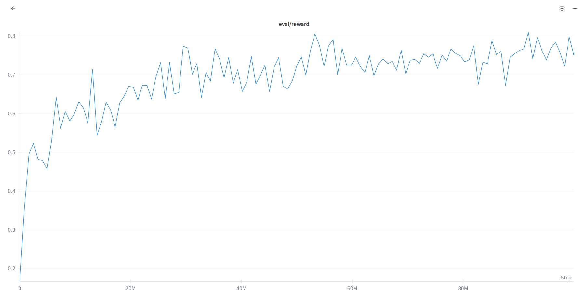
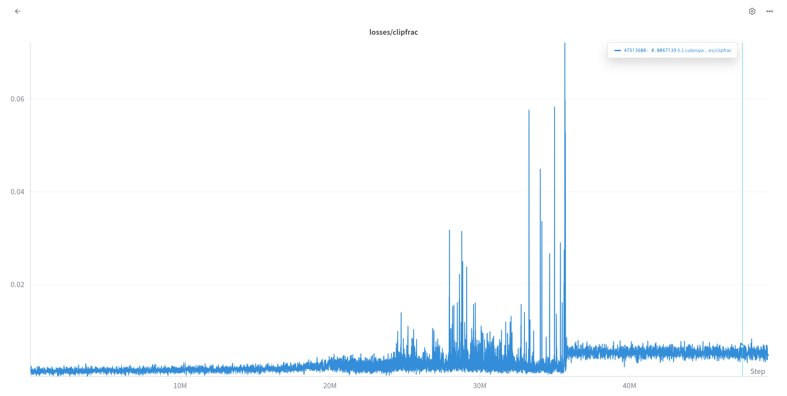
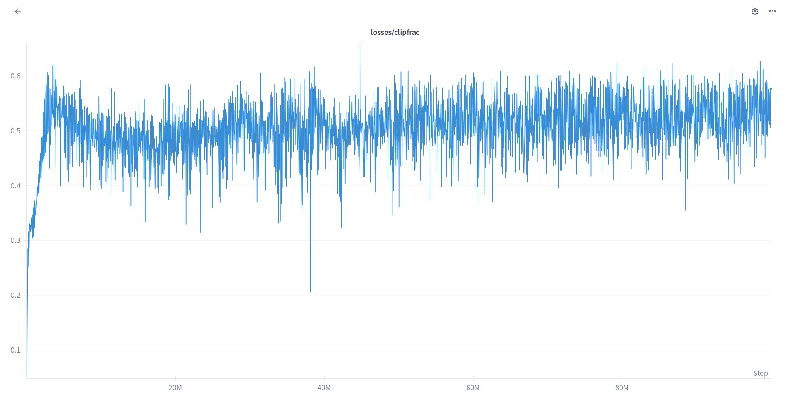
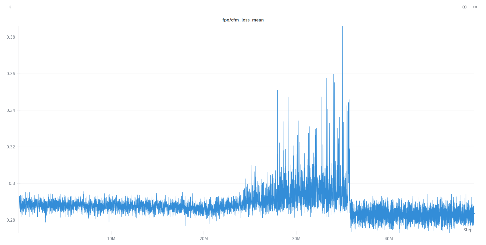

# Reinforcement Learning for Robotic Manipulation: A Comprehensive Overview
## Why RL is Integrated in Robotics
The hype of RL in robotics lies in its ability to handle the complexity and uncertainty of real-world scenarios. Traditional control methods often struggle with environmental variations in tasks. RL algorithms, particularly when combined with deep neural networks (Deep RL), can learn robust policies that generalize across diverse (random) conditions and adapt to unexpected situations. (What consistently works best in machine learning, is to ensure that the training data matches best with the test conditions.)

Modern RL approaches for manipulation typically involve training policies in high-fidelity simulation environments before deployment on real hardware--a strategy known as sim-to-real transfer. Using camera observations helps RL systems handle manipulation tasks better in unstructured environments.

## Brief Introduction to RL for Robotic Manipulation

### Core Concepts
Reinforcement Learning in robotic manipulation frames the control problem as a Markov Decision Process (MDP), where:
- **States** represent the robot's configuration and environmental observations (joint angles, camera images, object poses)
- **Actions** correspond to robot control commands (joint velocities, end-effector positions, gripper commands)
- **Rewards** provide feedback on task performance (task completion, efficiency, safety constraints)
- **Policy** defines the mapping from observations to actions that the robot should take

### Popular RL Algorithms for Manipulation
**Proximal Policy Optimization (PPO)**: A stable and sample-efficient policy gradient method that has shown excellent performance across various manipulation tasks. PPO's clipped objective function prevents large policy updates, making it particularly suitable for continuous control problems in robotics.

## Sim-to-Real Transfer
The simulation-to-reality gap remains one of the central challenges in applying RL to real robots. Things we implement for better transfer:
- **Domain Randomization**: Varying random parameters for colours or dimensions in a particular range for increasing policy robustness.
- **System Identification**: Carefully matching simulation parameters to real hardware characteristics through calibration procedures.
- **Progressive Transfer**: Gradually transitioning from simulation to real-world deployment through intermediate validation steps.
- **Visual Alignment**: Ensuring visual consistency between simulated and real camera observations through careful scene setup and calibration.

### Why Sim-to-Real Transfer is Brutally Hard: The Reality Check

#### Introduction: The Perfect Storm of Complexity
Sim-to-real transfer--"getting policies trained in ideal simulation environments to work on actual hardware."
Every roboticist has been there: your policy achieves 95% success in simulation, you deploy it on real hardware, and suddenly your robot is chasing its own shadow.

The fundamental challenge isn't just technical--it's that simulation is a beautiful lie, and reality doesn't match it. No matter how sophisticated your physics engine, how detailed your rendering, or how carefully you've tuned your domain randomization, the real world will find ways to break your assumptions that you never even knew you had.

#### The Visual Perception Nightmare

##### Camera Alignment: The Eternal Struggle
Camera alignment is where most sim-to-real attempts go to die. Your simulation camera might be perfectly positioned at (0.5, 0.2, 0.8) with a 45-degree FOV, but good luck replicating that exact viewpoint with any camera on a janky bracket. The `camera_alignment.py` script exists for a reason--it's an interactive nightmare where you spend hours tweaking camera positions pixel by pixel, trying to overlay simulated and real images until they somewhat align.

Your policy learned to recognize cubes in perfect lighting conditions, but now it's dealing with shadows, reflections, and the occasional finger smudge on the lens.


##### The RGB Reality Gap
RGB images in simulation are mathematical perfection and objects have clean, well-defined edges. Real RGB feeds are chaotic: inconsistent white balance, sensor noise, compression artifacts, and lighting that may change. The absence of depth information compounds this problem exponentially. Without depth, your policy has to infer 3D spatial relationships from 2D projections, which works fine when objects are rendered with perfect perspective. But real cameras introduce perspective distortion, and suddenly your cube that appeared to be 10cm away is actually 15cm away, just at a weird angle. The robot reaches confidently for empty air while the cube sits there, judging its life choices.

##### The Green Screen Solution (That Isn't Really a Solution)
The `capture_background_image.py` script represents our collective surrender to the visual complexity problem. Instead of trying to match simulation lighting to reality, we just give up and use green screen techniques to isolate the robot's workspace.

#### Hardware Calibration: When Physics Gets Real

##### Joint Calibration and the Analog World
Simulation joints are digital perfection--they move exactly the amount you command them to move, with zero backlash, infinite precision, and perfectly predictable dynamics. Real servo motors live in the analog world of gear backlash, thermal drift, and mechanical compliance. Your simulation might command a 5-degree rotation and get exactly 5 degrees. Your real SO100 arm gets 4.8 degrees, or 5.3 degrees, depending on the current load, temperature, and the phase of the moon.

The `SO100FollowerConfig` in the codebase includes parameters like `use_degrees=True` and port configurations that hint at the underlying complexity. Each real robot is slightly different--one might have 2 degrees of backlash in joint 3, another might have a slightly different gear ratio due to manufacturing tolerances. Your policy trained on the perfect digital twin, but now it's running on the imperfect physical reality.


#### The Overfitting Trap: When Success Becomes Failure

##### Shadow Chasing and Spurious Correlations
Perhaps the most embarrassing sim-to-real failure mode is shadow chasing--when your robot becomes convinced that shadows are objects worth interacting with. This happens because simulation environments often have simplified lighting models that don't accurately represent how shadows behave in reality. Your policy might learn to associate dark regions with object boundaries in simulation, only to become confused by the complex, moving shadows cast by real lighting.

The `domain_randomization=False` parameter in the evaluation scripts is telling--domain randomization is supposed to prevent overfitting, but sometimes it's turned off because it makes training harder. This creates policies that are incredibly good at solving the specific simulated environment they trained on, but helplessly confused by minor variations in reality.

#### The Technical Band-Aids We Apply

##### Careful Environment Setup
The evaluation pipeline includes extensive setup procedures to minimize sim-to-real gaps. The `setup_safe_exit()` function ensures that robots return to safe positions when things go wrong--and things will go wrong. The `Sim2RealEnv` wrapper class does heroic work trying to bridge the gap between simulation and reality, automatically applying wrappers and checking for consistency between environments. But it's fundamentally a complex band-aid on a deeper problem--simulation and reality are different domains that require careful manual alignment.

##### Control Frequency Compromises
The `control_freq=15` parameter in the evaluation code represents a safety compromise. Simulation can run at arbitrary frequencies with perfect precision, but real hardware needs time to process commands, update sensor readings, and physically move. The recommendation to keep control frequency at 15Hz or lower "for safety reasons" acknowledges that real robots can't match the responsiveness of their simulated counterparts.


##### Domain Randomization: The Nuclear Option
Domain randomization is our attempt to make simulation so chaotic that reality seems manageable by comparison. We randomize lighting, textures, physics parameters, and object properties during training, hoping that the policy learns to be robust to variations. It's like teaching someone to drive by randomly changing the steering sensitivity, brake responsiveness, and visibility every few seconds.


While domain randomization helps, it's also an admission of defeat--we can't model reality accurately, so we'll just train on every possible reality and hope one of them is close enough. The `domain_randomization=True` parameter in the recording scripts shows that this is a standard part of the pipeline, not an optional enhancement.

### Conclusion: Embracing the Chaos
Sim-to-real transfer is hard because it's trying to solve an impossible problem: getting a policy that learned in a simplified, deterministic world to work in a complex, stochastic one. Every successful sim-to-real deployment is a minor miracle of engineering, careful calibration, and just enough luck to make it work.

The scripts in this codebase--from camera alignment tools to green screen capture utilities--represent the current state of the art in managing this complexity. They're not elegant solutions; they're practical tools forged in the fire of countless failed deployments and late-night debugging sessions.

The reality is that sim-to-real transfer will always be hard because simulation will always be a simplification of reality. Our job isn't to solve this fundamental problem--it's to understand it well enough to build systems that work despite it. And sometimes, just sometimes, watching a robot successfully pick up a cube after hours of calibration and debugging feels like the greatest victory in the world.

Until it starts chasing shadows again.


# Flow Policy Optimization (FPO)

Flow Policy Optimization represents a significant advancement in reinforcement learning by bridging the gap between powerful flow-based generative models (like diffusion models) and policy gradient methods. Here's a comprehensive breakdown:

## Core Innovation: Replacing Likelihood with Flow Matching
The fundamental challenge that FPO addresses is that flow-based models excel at generating complex, multimodal distributions but are computationally prohibitive for exact likelihood computation - a requirement for traditional policy gradient methods like PPO. FPO's key insight is to replace the intractable action likelihood ratio in PPO with a proxy based on the conditional flow matching (CFM) loss.

**Traditional PPO ratio:**

The PPO ratio is defined as:
```math
r(\theta) = \frac{\pi_\theta(a_t \mid o_t)}{\pi_{\theta_{\text{old}}}(a_t \mid o_t)}
```

---

**FPO ratio:**In Flow Matching PPO (FPO), the ratio is estimated via flow-matching losses:
```math
\hat{r}_{\text{FPO}}(\theta) = \exp\left(
    \hat{L}_{\text{CFM}, \theta_{\text{old}}}(a_t; o_t)
    - \hat{L}_{\text{CFM}, \theta}(a_t; o_t)
\right)
```

---

**Theoretical Foundation:**

FPO's theoretical foundation rests on the connection between flow-matching losses and the Evidence Lower Bound (ELBO). For diffusion schedules with uniform weighting, the authors show:

```math
L^w_\theta(a_t) = -\text{ELBO}_\theta(a_t) + c
```
Minimizing the flow-matching loss is therefore equivalent (up to a constant) to maximizing the ELBO of actions, which approximates maximizing their likelihood. By constructing ratios from these losses, FPO effectively estimates likelihood ratios without explicit divergence computations.

---

**Mathematical Details:**

**Flow Matching Loss:**

The conditional flow-matching loss for an action-observation pair is:

```math
\hat{L}_{\text{CFM},\theta}(a_t; o_t) =
\frac{1}{N_{\text{mc}}} \sum_{i=1}^{N_{\text{mc}}} \ell_\theta(\tau_i, \varepsilon_i)
```
where:

```math
\ell_\theta(\tau_i,\varepsilon_i) =
\left\| \hat{v}_\theta\big(a_t^{\tau_i}, \tau_i; o_t\big) - (a_t - \varepsilon_i) \right\|_2^2
```

and:

```math
a_t^{\tau_i} = \alpha_{\tau_i} a_t + \sigma_{\tau_i} \varepsilon_i
```


This maintains the trust-region properties that make PPO stable while enabling the use of expressive flow-based policies.


## The Three-Step Algorithm Loop
1. **Sample Actions**: Use any flow-based sampler (deterministic or stochastic, any number of steps) to generate actions from the current policy
2. **Score and Compute Advantages**: Evaluate actions in the environment and compute advantage estimates using standard methods (GAE)
3. **Update Policy**: Train using the advantage-weighted CFM loss with PPO-style clipping

## Key Advantages Over Existing Approaches
- **Flexibility in Sampling**: Unlike methods that treat denoising as an MDP (like DDPO), FPO is agnostic to the sampling method used during both training and inference. This allows for:
  - Fast deterministic samplers
  - Higher-order integration methods
  - Variable numbers of sampling steps
  - Any flow/diffusion architecture
- **Simplified Implementation**: FPO maintains the standard flow/diffusion model structure rather than reformulating the problem as a multi-step MDP, making it easier to integrate with existing codebases.
- **Multimodal Policy Learning**: The expressivity of flow models enables learning truly multimodal action distributions, as demonstrated in their GridWorld experiment where the policy learns to reach multiple goals from saddle-point states.

## Practical Considerations
- **Computational Cost**: Flow-based policies are more expensive than Gaussian policies during both training and inference due to the iterative sampling process.
- **Hyperparameter Sensitivity**: Like PPO, FPO is sensitive to clipping parameters and requires careful tuning.
- **Monte Carlo Samples**: The number of (tau, epsilon) samples used for ratio estimation affects performance - more samples improve accuracy but increase computational cost.

# Implementing FPO in Pick Cube Task

We implement Flow Policy Optimization (FPO) for robotic manipulation, extending PPO with diffusion-based policies for the PickCube task.

## Core Architecture

### DiffusionPolicy Class
Replaces traditional Gaussian policies with a flow-based generative model:

**Key Methods:**
- `sample_action()`: Uses Euler integration for action sampling during inference
- `sample_action_with_info()`: Training version that tracks intermediate states and computes CFM loss
- `compute_cfm_loss()`: Implements conditional flow matching loss with stability improvements

**Sampling Process:**
- Initializes with scaled Gaussian noise
- Performs iterative denoising through Euler integration steps
- Applies velocity bounds and momentum damping for numerical stability
- Uses Huber loss for robust gradient computation

### Agent Architecture
- **Feature Network**: NatureCNN processes RGB observations and robot state
- **Critic**: Standard value function for advantage estimation
- **Actor**: DiffusionPolicy for action generation with PPO-compatible interface

## Training Pipeline

### Storage Requirements
Extends standard PPO buffers with FPO-specific data:
- Sampled noise vectors for each transition
- Time steps for conditional flow matching
- Initial CFM loss values for importance ratio computation

### Training Loop

**Rollout Phase:**
- Sample actions using diffusion policy with CFM data collection
- Execute actions and collect rewards/advantages
- Store noise vectors and time steps for training

**Update Phase:**
- Compute current CFM loss for stored trajectory data
- Calculate importance ratios from old vs new CFM losses
- Apply PPO-style clipping to importance ratios
- Optimize advantage-weighted CFM objective

## Stability Enhancements

### Numerical Safeguards
- Aggressive gradient clipping with divergence detection
- Velocity and ratio bounds to prevent exponential growth
- Multiple early stopping conditions for training failures
- Huber loss instead of MSE for outlier robustness

### Regularization Strategy
- KL penalty on importance ratios
- Action magnitude regularization
- Conservative noise scaling during sampling

### Monitoring System
Comprehensive logging tracks:
- CFM loss distributions and trends
- Importance ratio statistics
- Gradient norms and policy stability indicators

## Implementation Challenges
The code reveals several practical difficulties in applying FPO to robotics:
- **Computational Cost**: Requires multiple CFM loss evaluations per transition, significantly increasing training overhead compared to standard PPO.
- **Stability Issues**: Extensive regularization, bounds, and early stopping suggest the method is sensitive to numerical instabilities in continuous control domains.
- **Conservative Design**: Uses fewer diffusion steps and more aggressive regularization than typical FPO implementations, indicating trade-offs between theoretical fidelity and practical performance.
- **Engineering Complexity**: The implementation requires careful tuning of multiple stability mechanisms, making it considerably more complex than standard policy gradient methods.

This implementation demonstrates that while FPO can work for robotic manipulation, it requires substantial engineering effort to maintain training stability, suggesting the method may not yet be as robust as traditional approaches for continuous control tasks.


## FPO vs PPO Results

### Evaluation Reward
- **FPO**  
  

- **PPO**  
  

---

### Loss (Clip Fractions)
- **FPO**  
  

- **PPO**  
  

---

### CFM Loss (FPO only)



